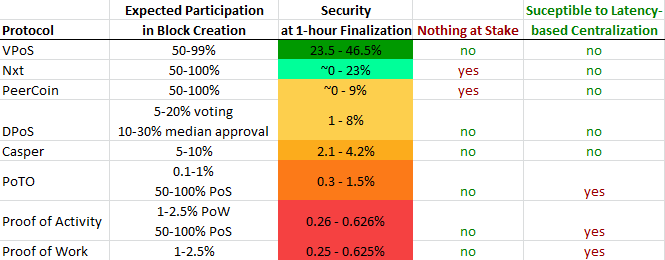

*Version: 0.99.0*  
*Status: In Review*

# Validated Proof of Stake

VPoS is a proof-of-stake consensus protocol for distributed ordering of cryptocurrency transactions as an alternative to pure Proof of Work. Its primary unique qualities are using validators for each block, and having a mechanism to incentivize minters to mine only on one of the candidate longest-chains without requiring lock-in stake.

## Problems with Current Solutions

Proof of work is a solid and secure mechanism for determining a canonical order of transactions, but a PoW system’s security is linearly related to expenditure of resources (which directly translates to transaction fees) and such a system is susceptible to centralization pressure that leaves a significant risk of a 51% attack. Also, there is the possibility (granted one that seems unlikely) that the amount of fees that must be paid for PoW to maintain enough security could be more than can be extracted via a fee market.

Hybrid protocols that mitigate some of these problems have the problems of potentially significantly increased network traffic, higher risk of censorship attacks, are susceptible to two types of mining monopoly attacks described later in the paper, or don't allow a large fraction of coin owners to practically mint blocks (eg Decred and Memcoin2). The reliance on expensive hashpower severely limits the maximum security any of these hybrid systems can plausibly attain. The security of hybrid protocols are discussed in more detail in [the spec for Proof of Time-Ownership](https://github.com/fresheneesz/proofOfTimeOwnership), which is the immediate precursor to this protocol.

Proof-of-Stake has the potential to decouple the security of the blockchain from resource expenditure, but other Proof-of-Stake systems have their own substantial problems, including the issue of resolving competing chains (the nothing-at-stake problem), the ability to cheaply create a fresh blockchain that compares as longer to the “true” chain, and the fact that requiring users locking up funds limits how many people can participate in minting blocks, among other issues.

VPoS seeks to completely eliminate a hashpower requirement to secure a cryptocurrency and to use coins alone to secure the system. This specification defines a protocol that maintains a high level of security without exhibiting the problems exhibited by other PoS systems.

## Benefits

* Is two orders of magnitude more secure than pure Proof-of-Work while using many orders of magnitude less real resources. Also VPoS is substantially more secure than other PoS proposals.
* Almost everyone can participate in minting blocks with only the resources necessary to run a full node (with the same resource usage as Bitcoin).
* Eliminates centralization of block creation related to network propagation delay. Because of this, the system can use lower blocktimes than other protocols and remain safe.
* Increases the incentives to run a fully validating node.

## Major Tradeoffs

* Has a failure mode where an attacker can permanently capture the system once they obtain near 50% of the active stake, after which the attacker can theoretically sell a majority of their stake without losing control of the chain. Where as, in systems that have a PoW component, capturing the system requires maintaining a certain level of work (and therefore cost-expenditure) during the length of the attack. This failure mode exists in all Proof-of-Stake systems.
* Slightly higher network traffic than PoW due to between 2-5 times more blocks to propagate (from competing forks) and 10-100 more kilobytes per block from validator information.
* Slightly bigger blocks by 10-100 KB needed for validator information.

# Contents

- [Validated Proof of Stake](#validated-proof-of-stake)
  * [Problems with Current Solutions](#problems-with-current-solutions)
  * [Benefits](#benefits)
  * [Major Tradeoffs](#major-tradeoffs)
- [Contents](#contents)
- [Protocol](#protocol)
  * [Terms](#terms)
  * [Block Anatomy](#block-anatomy)
  * [Verifying a Block](#verifying-a-block)
  * [Minter Secret](#minter-secret)
  * [Determining Block Difficulty](#determining-block-difficulty)
  * [Chain-length and Comparing Chains](#chain-length-and-comparing-chains)
  * [Block Rewards](#block-rewards)
  * [Minter Punishment](#minter-punishment)
  * [Proxy Minting and Proxy Validating](#proxy-minting-and-proxy-validating)
  * [Transaction finalization](#transaction-finalization)
- [Protocol Extensions](#protocol-extensions)
  * [Measuring Attack-cost and Fee-level Retargeting](#measuring-attack-cost-and-fee-level-retargeting)
  * [Incentivizing full validation by Proof of UTXO](#incentivizing-full-validation-by-proof-of-utxo)
  * [Switchover Extension](#switchover-extension)
- [Analysis](#analysis)
  * [Security: The Minimum Cost of Attack](#security-the-minimum-cost-of-attack)
  * [Mitigating Long-range Revision Attacks](#mitigating-long-range-revision-attacks)
  * [Minter Punishment Collateral Damage](#minter-punishment-collateral-damage)
  * [Detecting attacks](#detecting-attacks)
  * [Notes on Objections to Proof of Stake](#notes-on-objections-to-proof-of-stake)
    + [Analysis of Validators](#analysis-of-validators)
- [Potential Issues](#potential-issues)
    + [DOS risk](#dos-risk)
    + [Nothing-at-Stake](#nothing-at-stake)
    + [Time shifting](#time-shifting)
    + [Initial Coin Distribution](#initial-coin-distribution)
    + [Long-term Ownership Centralization](#long-term-ownership-centralization)
    + [Prediction Attack](#prediction-attack)
    + [Stake-grinding](#stake-grinding)
    + [History Attack](#history-attack)
    + [Progression capture](#progression-capture)
    + [Selfish Minting Hidden-chain Attack](#selfish-minting-hidden-chain-attack)
    + [Economic Minting Monopoly Attack](#economic-minting-monopoly-attack)
    + [Minter Bribery](#minter-bribery)
    + [Profit-seeking Minter Collusion](#profit-seeking-minter-collusion)
    + [Participation Barriers](#participation-barriers)
    + [Latency-based Block-creation Centralization](#latency-based-block-creation-centralization)
- [Comparisons](#comparisons)
  * [Comparison to Pure Proof of Work](#comparison-to-pure-proof-of-work)
      - [Short-Range longest-chain Attacks](#short-range-longest-chain-attacks)
      - [Long-Range Revisions](#long-range-revisions)
  * [Comparison to Ethereum's Casper Proof of Stake system](#comparison-to-ethereums-casper-proof-of-stake-system)
  * [Comparison to Delegated Proof-of-Stake (DPoS)](#comparison-to-delegated-proof-of-stake-dpos)
  * [Comparison to PeerCoin](#comparison-to-peercoin)
  * [Comparison to NXT](#comparison-to-nxt)
  * [Comparison to Proof of Activity](#comparison-to-proof-of-activity)
  * [Comparison to Proof-of-Time-Ownership](#comparison-to-proof-of-time-ownership)

# Protocol

This document describes the protocol using Bitcoin terms, but these techniques could be applied to pretty much any cryptocurrency. The protocol hinges on four key design aspects:

* Time-bound Proof of Stake - PoS minters compete with each other to create blocks. A minter is allowed to mint transactions into a block if one of their addresses comes up in a time-release progression. A very similar process is used to decide which validators are allowed to validate a block.
* Delayed-release Distributed Randomness - Randomness created collaboratively by minters and released only long after the randomness has been set in stone.
* Validation Signatures - Each block must be validated by a set of other minters before any block can mint on top of it.
* Minter Punishments - Where minters who mint too far on the wrong chain will be fined.

In VPoS, Proof-of-Stake (PoS) minters race for each block (rather than using quorums or voting). Each address has a chance of winning the right to mint a block each second based on the amount of coins that address contains. Just like Proof-of-Work mining is a race to find a block with a hash below a certain value, minting PoS blocks is also a race to find a hash below a certain value. However, where in PoW the number of tries you can do per second is unbounded, in VPoS (as in most PoS systems) minters only get one try per second per transaction output. This race incentivizes PoS minters to release minted blocks promptly once they become valid. For each block, the minter who can demonstrate that their address has won the right to mint a block then creates and propagates that block as usual. Then a number of validators do a similar process. Once the necessary number of signatures has been propagated, the next minter can then mint on top of that block. These validators substantially decrease the effectiveness of hidden-chain attacks.

Minters can mint for almost 0 cost, allowing almost anybody in the network to participate in block creation ("almost" anyone because a small minimum balance is required in order to mint). These minters also create an amount of randomness for each block, and include a proof in that block they can later use to verify they haven't changed that randomness when they finally reveal it to the rest of the network. This randomness is used to ensure that no one can game the system by predicting which addresses will get the right to mint or validate a particular block.

Minters are incentivized to mint blocks on top of a very limited number of candidates for the longest chain. What provides this incentive are punishment fines for minters who mint too far on chains that aren't the longest one. This eliminates the nothing-at-stake problem while at the same time also eliminating latency-related advantages for minters with larger stake. This is done without any locked-up stake or waiting periods, allowing anyone to use their coins to mint at any time.

## Terms

**Minter** - An address that is used to mint a PoS block.

**Minter secret** - A secret random value each minter creates for each block they mint and keeps secret for a period of time.

**Minter secret reveal** - `randomSecret+hash(blockHeader)` - A message containing the secret and the hash of the block header the secret proof is in.

**Minter secret lifetime** - The number of blocks after which a *minter secret* will no longer be relevant for future blocks. Also, the *mintingSourceAddress* of a particular satoshi is the address the satoshi was in `minterSecretLifetime` blocks ago.

**Active minter secret sequence** - The concatenation of all the minter secrets and hashes of the validator list in chronological order from all the blocks `minterSecretLifetime*2/3` to `minterSecretLifetime` number of blocks ago.

## Block Anatomy

A block has the following section of information:

* **Header** - This section contains meta information about the block (see below).
* **Minter signature** - `sign(prevBlockHash+curBlockHeader)` - A signature of a message that proves a minter attempted to mint a particular block. The message being hashed contains the *prevBlockHash* concatenated with the header of the current block being minted.
* **Block transactions** - This section contains the list of ordered transactions included in the block and their signatures. This also contains any *minter secret reveals*.
* **Validator info** - This section contains the list of validators who have signed the block and their signatures.

The block **header** contains at least the following information:

* **prevBlockHash** - `hash(prevBlockHeader+prevMinterSignature+prevValidatorAddresses)` - A hash of the previous block's header concatenated with the previous block's minter signature and its ordered list of validator addresses.
* **merkleRoot** - The root hash of the [merkle tree](https://en.wikipedia.org/wiki/Merkle_tree) for the *block transactions*.
* **blockTimestamp** - The time the block was created (or created *for*).
* **mintingSignatureAddress** - The address being used to create the signature needed to mint this block.
* **mintingSourceAddress** - An address that, *minterSecretLifetime* blocks ago, contained some or all of the coin now owned by the *mintingSignatureAddress*.
* **proxyMintingMessage** - (*Optional*) A proxy-rights message proving that the *mintingSignatureAddress* has the right to mint the block for that other address. This isn't needed if the block is being signed directly by the address that contains the coins.
* **Minter seed** - `sign(mintingSourceAddress+activeMinterSecretSequence+"0"+blockHeight+blockTimestamp)` - A signature used to determine whether the addresses used are allowed to mint the block. It consists of a signature of a message containing the *mintingSourceAddress*, the *activeMinterSecretSequence*, the constant "0", the *blockHeight*, and the *blockTimestamp* where the signature is created using the *mintingSignatureAddress*. If the coins didn't exist `minterSecretLifetime` number of blocks ago, they're not eligible for being part of a minter seed yet.
* **Minter secret proof** - `hash(minterSecret)` - A hash of the secret that is included in each minted block.

The **validation list** is a list of validation information, sorted by numerical value of *validator addresses*, where each item has the following fields:

* **validator signature address** - The address being used to create the signature needed to validate the block.
* **validator source address** - An address that, *minterSecretLifetime* blocks ago, contained some or all of the coin now owned by the *validatorSignatureAddress*.
* **proxyValidatingMessage** - (*Optional*) A proxy-rights message proving that the *validator signature address* has the right to validate the block for that other address. This isn't needed if the block is being signed directly by the address that contains the coins.
* **validator timestamp** - Expressed as a number of seconds passed the *blockTimestamp*.
* **validator seed** - `sign(validatorSourceAddress+activeMinterSecretSequence+"1"+blockHeight+validatorTimestamp)` - A list of signatures with a form very similar to *minter seeds* except the "0" is changed to a "1" and a different timestamp. This is used to determine whether the addresses used are allowed to validate the block.
* **validator signature** - `sign(prevBlockHash+curBlockHeader)` - A signature of a message that proves a validator validated a particular block.

## Verifying a Block

A node will accept a block as valid if:

1. `blockTimestamp < curTime` - The block's timestamp is earlier than that node's current time,
2. `mostRecentValidationTimestamp < blockTimestamp` - The block's timestamp is later than the most recent validation signature for the previous block,
3. `balance(mintingSignatureAddress) > minterPunishment` - The amount of coin contained in the `mintingSignatureAddress` must be greater than the `minterPunishment` amount,
4. `validSignature(mintingSignatureAddress, minterSignature, prevBlockHash+curBlockHeader)` - The *minter signature* is valid,
5. `minterSeed < applicableSourceSatoshi*maximumOutput/difficulty` - The hash of the block's *minter seed* must be smaller than the number of applicable source satoshi (which is the number of the *mintingSignatureAddress*'s satoshi owned by the *mintingSourceAddress* as of the block *minterSecretLifetime* blocks ago) divided by the `difficulty`, and
6. `forEach validator v:`  
 	A. `blockTimestamp < v.timestamp` - The validation signature's timestamp is later than the block's timestamp,  
	B. `balance(validatorSignatureAddress) > minterPunishment` - The amount of coin contained in the `mintingSignatureAddress` must be greater than the `minterPunishment` amount.  
	C. `validSignature(v.signatureAddress, s.signature, prevBlockHash+curBlockHeader)`, and  
    D. `v.seed < numberOfValidators*v.applicableSourceSatoshi*maximumOutput/difficulty` - The hash of the *validator seed* must be smaller than the required number of validators multiplied by the number of the *validatorSignatureAddress*'s satoshi owned by the *validatorSourceAddress* as of the block *minterSecretLifetime* blocks ago divided by the block difficulty.

To mint a block, the minter simply creates a *minter signature* and block header, then propagates those. Similarly, to validate a block, a minter simply creates a validation item (described above) and propagates it.

## Minter Secret

Each minter includes a hash of a secret random value inside the minted block - the *minter secret*. After `minterSecretLifetime/3` blocks, the minter is expected to broadcast the *minter secret reveal*. The period between `minterSecretLifetime*1/3` blocks and `minterSecretLifetime*2/3` blocks after it is a cooldown period intended to give each minter time to get their *minter secret reveal* into the blockchain (so they don't have much risk of missing their opportunity or being censored by a less-than-majority adversary). The secret will be used as part of the *active minter secret sequence* for blocks `minterSecretLifetime*2/3` to `minterSecretLifetime` blocks ahead of it. A minter will receive a reward for each block where their randomness is used for a subsequent block. If the minter fails to publish their secret until after that period has started, they'll earn fewer block rewards - ie they won't earn rewards for blocks where their secret wasn't yet available, and instead those coins will be burned (so other minters don't have much incentive to deny someone's minter secret reveals). If the minter publishes their secret after less than `minterSecretLifetime*1/3` blocks, the minter loses the right to any reward from the blocks their secret is used for - and again the rewards that minter would have gotten are instead burned.

## Determining Block Difficulty

`difficulty(h=0) = genesisSatoshi*targetBlocktime`

The first block will have a difficulty equal to the number of satoshi minted by the block multiplied by the number of seconds in the target blocktime. Subsequent blocks have a difficulty according to the following formula:

`difficulty(h) = difficulty(h-1)*recentBlocks/targetBlocksPerPeriod`

where

* `recentBlocks` is the number of blocks that have been found recently (for some chosen static period of recency like 2 weeks-worth of blocks)
* `targetBlocksPerPeriod` is the number of blocks the protocol intends to happen in that period
* `difficulty(h)` is the difficulty of a block at a given height `h`

Note that this means a block's difficulty doesn't change over time, and if there is a sudden decrease in active minting stake, the next block may take much longer to be found, but things will adjust in the next block.

## Chain-length and Comparing Chains

When comparing two chains to see which is longer, the longest chain is the one with the most accumulated difficulty (the sum of the difficulty of each block in the chain):

`Sum(difficulty)`

Furthermore, if an output has been spent in one chain before a given block height, it may not be used to mint blocks at any later blockheight in either chain. This prevents the "history attack".

## Block Rewards

The transaction fees and coinbase reward (fees and coinbase together being "the block rewards") would be split between the minter and the validators. A minter can receive a maximum fraction of `2/(validatorsPerBlock+2)` of the block rewards and validators each receive a fraction of `1/(validatorsPerBlock+2)` of the block rewards. A minter receives their maximum if the provided their *minter secret reveal* after `minterSecretLifetime*1/3` blocks after their minted block and before `minterSecretLifetime*2/3` blocks after their minted block. In normal cases this would mean that each minter would receive twice the reward that each validator receives. Any rewards a minter is denied because they didn't produce their *minter secret reveal* at the right time are burned.

## Minter Punishment

The ability for minters to mint on shorter chains in the hopes they become the longest chain (ie the nothing-at-stake problem) would destroy the system's ability to come to a finalized consensus for any block.

To combat this, a minter is allowed to include a proof, in their minted block, that another minter attempted to mint or validate a block on a chain where the most recent block is different from the chain in which the proof is included. If a valid proof is included in a block, the minter punishment fine is transferred from the address that minted or validated the offending block to the address that minted the block in which the proof was given, and if the address no longer contains enough coins to cover the fine, the minimum number of most recent transactions from that address will be invalidated in order to make enough coins available to cover the fine.

The proof will only be valid if the following conditions hold:

* the difference in height of the block in which the proof is given and the offending block about which proof is given is 9 or less,
* the offending chain extends at least 6 blocks beyond than the closest common block between both chains, and
* the offending block is at least 3 blocks beyond the closest common block between both chains.

The 9 block window is so there is a tight upper bound on how long a receiver must wait to be sure that their received transaction can no longer be invalidated by a minter fine applied to the sender. Since no profit seeking node will likely create or validate a block on an alternate chain beyond 3 blocks, 3 to 6 confirmations (6-12 minutes) gives similar confidence in transaction finalization to 1 bitcoin confirmation. The 6 block difference requirement is to limit the likelihood of minter punishment only to situations where the fork has continued for 6 blocks and is still contentious. The 3 blocks requirement to punish a particular minter is there to allow anyone to freely create forks up to 2 blocks long without negative consequence (this protects against short-range hidden-chain revisions - read the section on "Selfish Mining" for more).

The proof consists of a chain of *minter signatures* and/or *validator signatures* that lead back to a block on the current chain. Any minter included in that chain after a block that isn't in the current chain (for a block within 5 blocks of the current block) is fined. 

This punishment solves the nothing-at-stake problem in a way that doesn't require any locked-in stake for minters that would introduce a major barrier to minting. Note that this punishment could technically also be used to punish minters that mint on an invalid block, tho this doesn't have any intended use.

## Proxy Minting and Proxy Validating

An empty address A can be used for minting and validating blocks on behalf of another address B as long as the owner of address A includes a rights-message signed by address B (giving address A that right) in the block. The actual owner address B would be the one to receive any minted coins (not the minter address A). This would allow prospective minters to keep the keys securing their coins safely offline while still using their full balance to mint.

A proxy-rights message could also include a fee amount that can be given to any address. It could also include an expirey block, after which the rights are revoked. This would allow users to allow a 3rd party to use their coins to mint blocks, in order for that 3rd party to get part of the reward as a fee. This could also facilitate pool minting. However, pool mining (giving someone else the power to mint blocks for you) might incentivize minter centralization and disincentivize users from running their own full node, so perhaps a feature for giving a fee to another address shouldn't in fact be added.

## Transaction finalization

A transaction should only be considered finalized after 25 blocks (approximately 1 hour of blocks for a 2-minute blocktime) beyond the height of the heighest known conflicting chain that could revert that block. Because of the way minter punishment works, this is likely to be 28 to 31 blocks, but in the case of an attack, could be more. See the section on *Security* for how costly a double-spend attack would be with this finalization criteria.

# Protocol Extensions

## Measuring Attack-cost and Fee-level Retargeting

The cost of an attack can be measured by measuring the actively minting coins. The active stake can be calculated by using the stake difficulty:

`activelyMintingCoins = totalCoins/(difficulty*targetBlocktime)`

Using this measurement, an attack-cost target could be chosen (some amount of bitcoins, or some percentage of bitcoins mined so far, etc) from which you could derive the revenue per block necessary to maintain that attack-cost. Then that information could be used to dynamically change the block size such that the block revenue will then continue to support the chosen target for attack-cost. This would both make minting revenue more consistent, and ensure a certain minimum level of security while also minimizing fees. It, however, is an open question as to how elastic minting participation is when the block rewards are changed.

Another thing that could be done is capping the fees earned by minting a block, and giving an excess fees to minters of future blocks with below average block rewards. This could further stabilize block rewards but might have unintended side effects on transaction selection.

## Incentivizing full validation by Proof of UTXO

Since deciding which fork to follow can only be done by fully validating nodes, its critical that a majority of that currency's economic actors (when counted by transaction volume) actively decide which forks to allow either by fully validating the chain or by intentionally and actively choosing a delegate to validate for it (eg using an SPV server or, in the case of VPoS, by delegating a minter proxy). This goal can be furthered by requiring that minters have the full UTXO set in order to practically mint blocks. This is further discussed in the [PoA whitepaper under the section "Discouraging thin clients by Proof of UTXO"](https://www.decred.org/research/bentov2014.pdf) and in the [Permacoin whitepaper](http://soc1024.ece.illinois.edu/permacoin.pdf).

## Switchover Extension

If VPoS is added to an existing cryptocurrency, like Bitcoin, it wouldn't be wise to switch over abruptly because the system would start out with no active minters, giving an attacker the opportunity to exploit that to their benefit by becoming a large fraction of the set of active minters. To prevent this weakness, the chain-length equation could start without any consideration of PoS blocks and could be switched over to the chain-length equation shown above once enough active stake is in the system. Everything else about the protocol could be kept in place, including PoS block rewards (to entice people to actively mint).

# Analysis

## Security: The Minimum Cost of Attack

The basic minimum cost to attack any consensus protocol is finding the minimum cost an attacker would have to expend, risk, or obtain in order to have a high likelihood of successfully executing an attack within a reasonable timeframe. While an attacker can't control a VPoS blockchain indefinitely without first gaining control of nearly 50% of the active stake, an attacker would likely not need quite that much active stake to have a reasonable probability of successfully attacking the system. For the purposes of this security analysis, I define "security" to mean:

* The lower bound on how much an attacker would have to spend in order to get at least 1 chance per year of one of the following:
   * a censorship attack lasting at least 1 day, or
   * a single double-spend attack requiring a hidden chain that ends up being longer after the protocol's recommended number of confirmations for finalization

In VPoS, a censorship attack and double-spend both require controlling all the blocks in the chain, and so have the same cost per block. Therefore we can simplify this by only looking at the double-spend attack case (since that has the smaller requirement: a few blocks of chain control vs a day). The cheapest kind of attack would look like this:

1. The attacker would gain a high percentage of the actively minting coins
2. The attacker would make a large number of purchases totalling a large value
3. As soon as they complete their purchases (which might happen within seconds), the attacker releases a new block branching off the block on the main chain before any of their transactions were confirmed
4. Honest validators would validate that new block (with no potential downside)
5. The attacker would release another block on that new chain, and more honest validators would validate those blocks.
6. Since honest validators wouldn't likely validated any blocks beyond those first two (because of the higher likelihood of being fined for minting on a chain that isn't the main chain), and because the attacker wouldn't want to alert their victims that a double-spend attack might be underway, the attacker now has to build the rest of that new chain themselves as a hidden chain. So the attacker needs to then find and validate 6 additional blocks with their own stake.
7. Once the attacker receives the products they bought (which is likely to happen at 8 blocks), the attacker releases the chain publicly which then becomes the longest chain.

For 2-minute blocks an attacker would have to find 27 blocks (for a finalization time of about 1 hour) before the honest group could. An attacker would have to have about 47% of the active stake in order to do this. The code I used to calculate this can be found in [costOfAttackVPoS.js](costOfAttackVPoS.js).

Note that even at this level (47%), the attacker risks failing the attack and losing any minting revenue they would have otherwise received (*tho if you have an enormous fraction of the coins, its likely the minting revenue would be a drop in the bucket*). The bigger risk to the attacker is that if they do in fact succeed, it would in turn crash the value of the currency and render their substantial stake in the coin nearly worthless. This is in contrast to proof-of-work where an attacker's success would at most render their mining operation worthless, and a mining operation is unlikely to be valued anywhere near 50% of the coin, since that would mean the miners in total are spending as much to mine the currency as the currency itself is worth, which would be counter productive. Also, mining hardware is unlikely to be completely worthless even if the value of the coin is destroyed, since that hardware can be repurposed.

At 47% of the active stake, an attacker would still not be able to capture the minter progression and would need much closer to 50% in order to do that.

Because VPoS allows and encourages anyone to mint blocks, its realistic to imagine that a coin using VPoS could have upwards of 50% actively minting stake. The holy grail is achieving near 100% active stake and thus a minimum cost-of-attack of nearly 50% of the total coins. It seems like this protocol makes it possible to get incredibly close to this ideal.

## Mitigating Long-range Revision Attacks

Long-range attacks are where an attacker builds off the chain from a block height that was a long time in the past (*some large percent of the blockchain ago, eg 50% of the blockchain ago, which for bitcoin would be a chain split off from a block mined more than 4 years ago*). In a basic PoS system, an attacker can construct a long-range revision or even a completely fresh chain for very little cost. Without some way to prevent it, this could allow the attacker to control every address that owns coins on that chain.

In pure proof-of-work, a long-range attack is always more expensive than a short-range attack, but in VPoS this isn’t necessarily the case. Because there is no work requirement to create blocks, its plausible an attacker could build an entire new fresh chain longer than the real chain in an arbitrarily short amount of time. At the same time a shorter-range revision would be much harder because the attacker would have to actually obtain a substantial amount of honest coins or obtain access to the private keys of addresses that used to contain substantial amounts of coin.

In my opinion, the ideal way to mitigate long-range revision attacks is to hardcode checkpoints in node and wallet software. This would be some code asserting that a block at a certain height has a certain hash and only chains that contain that block at that height are valid. Since users must already either validate or trust their software, having a checkpoint like this would be simply another thing that should be peer-reviewed, and thus doesn't introduce any additional level of trust nor security risk. Including this hard-coded checkpoint would completely eliminate the possibility of a long-range attack that split from the true-chain before the checkpoint, even for new entrants and SPV clients using a compromised SPV server. Note that a checkpoint like this should only be something the user manually updates (eg with a manual software upgrade), and NOT via an automatic or centrally broadcast message as others have suggested. In fact, automatic updates of this kind of decentralized software are never safe and can not be done without introducing a fundamental level of trust in the source of those updates.

The following additional way to mitigate this is *not* suggested since its redundant with checkpoints as described above.

A second way to mitigate this type of attack is for nodes to reject revisions if there is no common block (a complete fresh-chain) or if the highest common block is dated more than X days ago (eg 1 day). However this rule wouldn't help new nodes just entering the network, especially if they're being sybil attacked, and wouldn’t help SPV clients using an compromised SPV server that uses the new chain to show proof that a transaction exists in a valid chain with an appropriate length.

A method for mitigating medium-range revisions is to require that transactions include the hash of a recent block in the chain. This method was proposed by Nxt. That way any attacker trying to build a medium-range revision can't use real transactions to build their chain, making it very obvious to anyone who made or received a transaction in that range which is the attacker-chain. This still isn't perfect because anyone who hasn't made those transactions or doesn't notice still might choose to follow the attacker's chain. 

## Minter Punishment Collateral Damage

In the process of minting, some unlucky honest minters will mint on a chain they think will remain the longest but actually becomes beat out by another chain. This will mean some honest minters get fined for minting. However, the number of honest minters that have to pay fines should be lower than the number of honest minters that mint a block on the longest chain, so as long as the fine is lower than the revenue received from minting a block, the expected revenue from attempting to mint should be greater than 0. In fact, the frequency of this fine should be incredibly small. Given Bitcoin's orphan rate is about once every 5 days on average, which is a 0.1% chance per block, the chance of 5 conflicting blocks in a row should be so low that it should take thousands of years for it to happen.

Since the fine probably doesn't need to be very big to be effective, the expected revenue from attempting to mint should be approximately the full minter revenue. How big the fine needs to be depends on the likelihood that dishonest minting on a shorter chain ends up in the dishonest minter's favor. So the size of the fine is up for debate.

One behavior to consider is that a minter might refuse to mint on a block if there is more than 1 choice (ie a collision where one will be orphaned) so as to avoid the punishment. However, if they do that, they also avoid the likely benefit (which would be much higher). So because the expected gain is greater than 0, both profit seeking actors and altruistic actors wouldn't exhibit this behavior.

## Detecting attacks

When an attack happens, part of the security of the system, beyond the narrow definition above, is how much damage can likely happen in an attack. Detecting an attack early can help limit that damage. Detection can potentially catch an attack in the act so that steps can be taken to halt the attack, or detection can detect that an attack has likely happened in the past so that steps can be put in place to prevent future attacks. Detection can also have false positives, which might be acceptable if they increase the cost of attack or decrease the amount of damage that can be caused. However, detection with false positives has the possibility of being abused by an attacker to wreak other types of havoc, so the consequences of false positives should be considered carefully.

In any attack involving a hidden chain, most nodes in the system will become aware of both the honest chain and the attacker's chain. While those nodes might not be able to tell for certain which is the attacker's chain, they will know something weird is happening and can react to that. In the case that this happens, nodes following the protocol will require more confirmations on transactions until the competing chains are resolved.

In the case that an attacker attempt progression capture, any large minter will be able to detect that it is taking far longer for them to mint blocks than it should. In such a case, a simple update introducing additional one-time randomness into the active minter secret sequence can break the attacker's hold on the blockchain, forcing them to either halt their attack or restart their attack by re-purchasing the coins they had sold up to that point.

## Notes on Objections to Proof of Stake

Many have called proof of stake pointless because any incentive provided to mint PoS blocks will tend toward using an equal amount of resources to the expected reward. See [this article](http://www.truthcoin.info/blog/pos-still-pointless/) for some exposition about that. I agree that it is indeed the case that minters will attempt to expend as much cost as they can in order to maximize their minting rewards. However, this argument has two critical flaws.

The first flaw is that the amount a blockchain costs to support is different from the amount a blockchain costs to attack, and the ratio of blockchain incentives over cost of attack differs between consensus protocols. Consider Bitcoin: in an equilibrium state, an attacker of a pure proof-of-work system like Bitcoin will require purchasing 1/2 of the honest hashpower and running that hardware for the duration of the attack (which could be as little as 1 hour). On the other hand, the honest miners normally must run and maintain this hashpower at all times ad infinitum. So the cost of maintaining the system is far more than the cost of attacking the system. In VPoS, the attacker must gain nearly 50% of the actively minting coins which would be a far higher cost than obtaining half of Bitcoin's hashpower, and yet honest minters aren't expending any significant resources at all to maintain this security. What this means is that the incentive provided in a system using VPoS can be far lower for a given level of security than in a PoW system.

The second flaw is that the cost of holding on to currency in order to mint PoS blocks (rather than investing it in some other way) is only a cost to the minter, not to the economy in total. Again, let's consider Bitcoin. When a miner uses electricity to run their mining hardware, the miner loses the electricity (its expended) but also on a global scale that electricity isn't available for anyone else - it is gone for everyone. However, this isn't true of currency. If some currency is removed from circulation by its owner (say for the purposes of minting), all other currency in circulation increases in value by exactly the amount removed from circulation (for the period of time that currency was out of circulation). In other words, while the minter who's using their currency to mint can't use it for other things and thus incurs an opportunity cost, the total value in the economy does not change at all. So a pure proof-of-stake system allows costs to be incurred by individuals while no net economic cost is actually incurred when considering the total economy. This essentially makes proof-of-stake free, even tho its minters do incur opportunity costs. This line of reasoning is actually closely tied to why a non-inflationary currency (ie a currency who's total quantity of coins doesn't change over time) won't actually be the doomsday scenario some have feared.

[BitFury's 2015 paper "PoS vs PoW"](https://github.com/blockchain-university/databank/blob/master/docs/pos-vs-pow-1.0.2.pdf) concludes that "*the state of a PoS system cannot be reliably determined by new users based solely on protocol rules and a list of blocks and other network messages obtained from peers. In order to prevent long range forks of the blockchain, a proof of stake system needs to implement weak subjectivity by combining protocol rules with a social-driven security.*" I believe this is highly misleading because protocol rules themselves are socially-driven. People must ensure that the software they run implements the protocol they want it to. Above, I suggested that a static checkpoint be included in these rules encoded by the software that makes up a coin's network. This can unambiguously protect new users from long-range revisions, so I don't believe this is a reasonable criticism.

### Analysis of Validators

The concept of block validators does two things: it provides a mechanism for distributing minting rewards to more people without introducing any significant centralization pressure, and it limits the effectiveness of the Selfish Mining Attack.

Since the security of VPoS depends on how much of the owned coins are actively searching for a block to mint, maximizing this proportion is important. At a high proportion of actively minting coins, getting to mint a block would be like winning a lottery: cheap to participate in but rarely rewarded. For example, if each of the world's ~7 billion people had equal stake, with a 10-minute target blocktime there would be about 52,000 blocks per year giving about 1/133,000 chance of winning the ability to mint a block each year if everyone participated.

Since the ability to mint 1 block every 133,000 years might not entice enough people to actively mint, having validators introduces more winners to reduce the variance between earning block rewards. For example, if we chose `validatorsPerBlock=10,000` the chance of either minting or validating a block would be 75/1000 per year (ie you could expect to either mint or validate one block every 13 years). This would probably be a lot more enticing since you could actually expect to win at some point.

Of course, the more people that share the block rewards, the less reward there is per person. But if we assume people make about 10 transactions per day on average with a fee of something equivalent to half a cent per transaction (on average of on-chain fees associated with lightning channel rebalances or reopenings), that would still be a very substantial reward per minter of about $24,000 (*7 billion people * 10 transactions per day per person * 0.5 cents per transaction / 144 blocks per day / 10,000 minters per block*).

So to really maximize active stake might require some experimentation and possibly constant automated retargeting, similar to the above proposal for retargeting the block size.

Validators also increases the network's security in two ways. It increases security in-so-far as it increases the proportion of the total coins used to actively mint and validate. It also increases security by making hidden chain attacks much more difficult - not only does an attacker need to mint a long string of blocks in a row, but the attacker must also validate their own blocks. This requires an enormous amount of stake to accomplish.

Validators cause some additional network traffic, since the signatures need to be sent around the network. Block size would increase as well, both proportionally to how many validators are required to finalize a block. With something like 100 validators, this shouldn't be much extra overhead. This mechanism might also reduce or even eliminate any minter centralization pressure associated with propagation times, since blocks can be finalized (and mined on top of) by anyone that has collected enough signatures for the block rather than by a single person (eg the last miner, in bitcoin). Some more analysis of that would be required to say that with any level of certainty tho.

# Potential Issues

### DOS risk

A potential problem in PoS systems is risk that stakers will be attacked with a Denial of Service attack. In many systems, the stakers able to mint a block are known as soon as the previous block is minted, or possibly even earlier. In those cases, those minters could be DDOSed (by competing minters and miners or by other malicious actors). 

In VPoS, since the minter seed is generated using a signature of the minter, no one other than that minter can know if they'll have the opportunity to mint a block. So it would not be possible to practically DOS minters since the attacker would have to DOS everyone in the network. Because of this, I don't think this is a credible threat to a VPoS system.

### Nothing-at-Stake

Since there is no punishment or downside for minters to mint up to 2 blocks different than the main chain, its likely and actually encouraged that every active minter that comes up in the progression will attempt to propagate their block up to 2 blocks out from other known chains, creating a number of competing chains that will only resolve to a single chain when a 3rd block is minted on top of one of the competing chains. In fact, the property of nothing-at-stake can be used as an advantage, which is why this behavior is encouraged for up to 2 blocks out (read more about this in the section on "*Selfish Mining*").

Note that this would multiply minting-related network traffic by an average of 6 times (1+2+3). Minters can avoid punishment even after minting blocks 3-5 out from the eventually chosen main chain as long as that chain never gets beyond 5. While this weaker guarantee makes it unlikely nodes will decide to mint a block 5 blocks out from another chain if they know another chain already has 5, it makes it possible that some minters will mint competing chains of that length difference. In any case, the nothing-at-stake problem is limited to being a problem only for 2-5 blocks until punishments actually start happening - which is one reason a transaction shouldn't be considered totally finalized until it has had many confirmations.

Because minters and validators can't be punished for minting/validating a block on the wrong chain if that block's height differs by 10 or more, its theoretically possible that minters would mint blocks at old heights just because they can without any downside. If they did, it would potentially make it easier for an attacker to do things like double-spend. However, the likelihood of being rewarded for that behavior is so much lower than the likelihood of minting a block normally that the tiny cost of just downloading and installing a different piece of software would be more than its worth for even a perfectly profit seeking actor. So it seems quite unlikely for this to be a problem.

### Time shifting

If actors are incentivized to alter network-time to their advantage, things could go wrong. People might want to pretend time is moving faster in order to see more minting rewards. However, hopefully there would be enough honest actors to counteract this. Shifting time backward (pretending time is moving slower) could give current potential minters more time to realize they're a potential miner, mine, and broadcast the next block, but any active minter is probably instantly aware of this already and minting a block would be a fast operation. Broadcasting can take some seconds, and so might provide some small incentive to time-shift backward. But even if network-time becomes shifted over time, the accuracy of network time isn't that important, only approximate consistency. And in any case, time-shifting is a problem in PoW systems as well.

### Initial Coin Distribution

Since only people who have coins can mint PoS blocks, those people would have an advantage in gaining new coins. The problem of fair distribution is somewhat of a contentious one. Some people think things like ICOs are perfectly fine and give the creators compensation for their efforts. Others think that only a world-wide race to create and own a currency is fair.

Regardless what is fair, I believe a currency has a far better chance at succeeding if its distribution is as wide as possible among the people interested in obtaining the coin. If this protocol is being switched over to from another protocol, then there probably wouldn't be a problem to solve, since that coin likely already has a significant fraction of its coin distributed.

If the coin is starting fresh tho, one way of distributing this would be to use PoW mining for the majority or entirety of the distribution. However, this also has its flaws. Its not always possible to verify who is mining the coin, and thus its possible the group that created the coin are its primary miners. It also adds an extra PoW step that complicates the protocol. So I want to propose a different solution: public giveaways.

The idea is to send newly minted coins to anyone who posts their wallet address on a website with a verifiable owner (person or organization). Not only would this be a good way to promote a new coin, but it would also provide the community with a public way to verify distribution of the coin and calculate an upper bound on how much the original owners kept for themselves. Here's a suggested distribution policy: Over the course of 2 years, start giving 5% of newly minted coins every day to a different verifiable person or organization, and give away 1.009 times the previous day's percentage each day. If this is followed, one year in, the initial distributor will own about 50% of the coin, and after 2 years will control about 10% of the coin. Two years should be long enough to build a healthy market for purchasing the coin so anyone can buy coin in order to mint. 

### Long-term Ownership Centralization

Some have brought up the idea that proof-of-stake makes the rich get richer, so to speak. The idea is that the people who have more money will make more money and this would somehow lead to the largest owners eventually owning all the coins. However, this isn't actually what would happen. Since each actively minting address has a chance of minting exactly proportional to their ownership, this means that your expected ROI for minting (as a percentage) will be the same no matter how much coin you own. This means that if everyone is actively minting, no one will gain or lose anything on average over time, tho those that are actively minting would gain more than those that aren't. Also, something similar is true for proof-of-work as well - those that have invested more in mining hardware mine more blocks and thus make more money.

Note that while most PoS don't actually have this problem, Nxt's coin actually does have a rich-get-richer problem because of the way their minting requirement is set up. See [Bitfury's paper on PoS systems](https://github.com/blockchain-university/databank/blob/master/docs/pos-vs-pow-1.0.2.pdf) for details about that.

### Prediction Attack

A prediction attack would be executed by predicting what minter addresses will come up for some blocks in the future, generating addresses that come up very early in the minter progression, then moving their funds into those addresses so they can mint a higher proportion of blocks than their coin ownership would normally allow. However, because minters generate hidden randomness that determines the minter progression, as long as the randomness generated by minters can be considered a random oracle, accurately predicting the minter progression should be practically impossible. In fact, each minter has an incentive to generate true randomness and keep that randomness secret according to the protocol, since if minter X released their secret, a different minter Y might be able to predict the progression for some future block that minter X would otherwise have won. Also, as long as any two pieces of the randomness (out of potentially hundreds of pieces) is kept secret by two separate actors, no one would be able to practically predict the minter progression.

### Stake-grinding

Stake-grinding is a potential problem in PoS systems where the minter is allowed to significantly affect the likelihood that an address will be given the right to mint on top of a future block. Because of the *minter secrets* that aren't revealed until after the outcome could be affected, VPoS doesn't have this problem unless the attacker controls the entire chain (see also *progression capture*).

### History Attack

In a "history attack", someone acquires a large number of tokens, sells them, and then creates a fork from just before the time when their tokens were sold or traded. If the attack fails, the attempt costs nothing because the tokens have already been sold or traded; if the attack succeeds, the attacker gets their tokens back (a successful double-spend). Extreme forms of this attack involve obtaining the private keys from old accounts and using them to build a successful chain right from the genesis block.

VPoS protects against this by revoking minting rights from transaction outputs that have been moved in any chain, when comparing multiple chains. This allows any node to decide which is the correct chain in the case of a history attack by seeing that the correct chain contains transactions that invalidate the minters in the attacker's chain.

### Progression capture

Similar to quorum capture in quorum-based protocols (like Casper), this attack uses elements of prediction, stake-grinding, and the history attack. An attacker would acquire enough coin to be able to mint enough blocks in a row that they're able to control all the minter secrets. Once the attacker does this, they then permanently control the chain as long as they continue to censor all other minters. Not only can they control the chain, but they can sell off the vast majority of their stake while using stake grinding to figure out what minter secrets to put into blocks in order to keep control of the system. With no lower bound on how much work or time it takes to stake-grind, the amount of stake an attacker needs to keep in order to keep control over the blockchain can theoretically be arbitrarily close to 0 (as long as its actually above 0).

There are two caveats to this attack:

* An attacker can't sell 100% of their coins, since they need some coins in order to continue minting. There is some theoretical lower bound on how much stake an attacker could sell before stake-grinding becomes very expensive. So while an attacker might be able to sell 99% of their coins, they're unlikely to be able to sell most of that last 1% without losing control of the chain.
* Because of non-infinite market liquidity, there would be a maximum rate at which the attacker could sell their coins. The attacker could spend their coins on many different types of assets to get around this tho. Even with that workaround, the price of the coin is likely to tank as soon as people realize that large stakeholders are no longer being allowed to mint blocks. At this point, the community can spring into action and release software that defends against the attacker (which could realistically solve the problem for most people within a week or two, although much damage can be done in that time). This could be compared to a PoW attack where once the attack (say double-spend) is complete, the attacker can sell or reuse the hardware they used in the attack, at which point the final cost the attacker incurred is only the maintenance, electricity cost, and depreciation of the hardware (during the attacker period, which could be as little as 1 hour).

All pure PoS systems are fundamentally susceptible to this kind of progression capture because any randomness is controlled by minters themselves (whereas in PoW, the randomness comes from the work and is not controlled by the miners).

### Selfish Minting Hidden-chain Attack

A Selfish Minting Attack or [Economic Attack](https://bitcoinmagazine.com/articles/selfish-mining-a-25-attack-against-the-bitcoin-network-1383578440/) is where a selfish minting (and/or mining) strategy can allow a particular entity to gain more than their fair share of blocks and thereby either run honest minters out of the system by reducing their revenue below profitable levels or incentivize miners to join their coalition of selfish mining. Both of these outcomes increase the risk of a single entity or coalition gaining enough hashpower/stake to control the chain and do things like double-spend.

[A paper](https://arxiv.org/abs/1311.0243) was written that talked about how Bitcoin is susceptible to this attack no matter how much hashpower the attacker has if the attacker uses a network of nodes that pretend to be mining but actually are used to propagate the selfish-miner's blocks faster than the rest of the network. The paper suggests a partial-fix that when a miner has two potential chains of equal length to mine on top of, they randomly choose the chain to mine on top of. The paper says this makes it so the attacker requires 25% hashpower and goes on to say that theoretically there is no fix that could make this requirement larger than 33%. However, [it has been argued](https://www.yours.org/content/craig-wright-s--negative-gamma--and-the-curious-lack-of-intellectual-c-191f72455730) that the network topology of Bitcoin mining nodes is almost a [complete graph](https://en.wikipedia.org/wiki/Complete_graph) which prevents a network of fake mining nodes from being effective, and so therefore the threshold is actually 33% rather than 25%.

VPoS largely doesn't have this problem because of the following barriers to successfully executing this attack:

* Because VPoS allows minters to create risk-free forks up to 2 blocks from their common root, an attacker would need to build a secret chain for at least 3 blocks, or honest minters will usually overtake the secret chain once its published (by retroactively submitting blocks with earlier-than-actual timestamps). This significantly decreases the likelihood that an attacker can succeed in this attack.
* Validators makes this (and any hidden-chain attack) far harder for a minority attacker, since the attacker would have to not only be able to produce 3 blocks faster than the majority main chain but would also have to produce hundreds of signatures faster as well.
* Since VPoS doesn't provide a trustless way to pool stake, if this causes users of a VPoS coin to be less willing to use minting pool then there would also be less risk of an attacker succeeding using this attack.
* An attacker would not attempt attempt the attack every time they theoretically have the opportunity, since they wouldn't know exactly which addresses will be the honest active minters competing against them. Because of this, an attacker would only attempt the attack when they have greater than 50% chance of succeeding according to what they know. Note that the higher the percentage of actively minting coins is, the more precisely the attacker will know which addresses they're competing against and can win a higher fraction of their opportunities, however this is strictly worse for the attacker since a higher percentage of actively minting coins means they have to obtain more total coins even if the percentage of active coins they need to own is lower.
* This attack can't be used to perform either a double-spend or a censorship attack in VPoS, since both those require controlling the whole chain and any advantage an attacker could acquire would not push other minters out, while PoW miners *are* pushed out in this kind of attack.

In the simplest case where 100% of coins are actively minting, the percentage of active stake the attacker must own is at minimum. With 100 validators, the attacker gets an opportunity only in cases where the attacker's address comes up in the *validator progression* 303 times (3 blocks * (1 signature per block + 100 validators per block)) before actively validating honest addresses. This would require a far higher percentage of the coin to offer any significant probability of success. For an attacker with 45% of the coins in this case, they'll have an opportunity to mine an extra block 3 times per day on average and earns an approximate 1.22% more blocks than their proportion of the coins. This clearly shows that this attack can be effective at high coin ownership. However, for an attacker with 42% of the active coins, an opportunity to do this would happen on average once every 60 days. An attacker would have to have about 44% of of the active coins to obtain any significant revenue advantage (0.27% more blocks). So at 100 validators, we can say that 44% is the minimum fraction of active stake an attacker must have regardless of how well it can predict the honest network activity. The code I used to calculate these numbers can be found in [selfishMiningCalculator.js](selfishMiningCalculator.js).

Because this attack can't be used by an attacker to increase their chances of double-spending or censoring transactions in VPoS, the result of a successful attack is very minor and isn't a concern. However, in a protocol relying on PoW, this can lead to centralization of hashpower which can be used to substantially increase an attacker's chances of double-spending. It should be noted that this attack can't be done at all in any currency that has the nothing-at-stake problem, since minters can simply create chains from any previous starting point, allowing them to bypass the 2nd block of the attacker's hidden chain whenever the attacker releases it, negating any benefits the attacker could receive.

### Economic Minting Monopoly Attack

Consider a mining environment where mining has near-break-even revenue (or exactly break-even considering opportunity cost) and where there are no altruistic honest miners willing to mine at a loss. In such a situation, any entering mining power would correspond with an exit of a similar amount of mining power (theoretically an identical amount of mining power, given identical minting costs). What this means is that an attacker willing to mine 100% of the blocks at a loss can obtain 100% of the (active) hashpower.

The attacker with cost-effective hashpower could slowly obtain more and more hashpower while incurring very little loss, since any consistent loss is unsustainable for miners mining as a business and miners would stop mining until the remaining miners miners would again be profitable. The quicker the attacker gains this hashpower, the less loss they would incur. For bitcoin's 2-week difficulty periods, if the attacker obtains all the hashpower in that 2-week period, they would incur no loss at all during that time, and would only incur loss for the amount of time it takes the honest hashpower to stop mining bitcoin (probably to switch to a different cryptocurrency) once the difficulty adjusts.

Because this attack vector has nothing to do with manipulating the blockchain in programmatically detectable dishonest ways, there's no way to prevent anyone from executing this, other than by increasing the cost of obtaining enough hashpower such that operating that obtained hashpower exceeds the revenue earned by mining blocks. This means that any system where miners compete with each other via hashpower and relies on the attacker not achieving near-100% of the hashpower, is susceptible to this attack.

Even detecting this attack would be difficult as this would look like some miners simply found a more cost-effective way to mine. What you would see is that the honest miners who identify themselves in their blocks will stop mining. Once a lot of such miners exit the system, the only way to prevent the attack would be to add more block revenue (coinbase reward and fees).

Bitcoin is also susceptible to this, which means that an actor attacking Bitcoin at equilibrium (which Bitcoin is not at today) would only need to obtain an amount of hashpower equal to half the existing hashpower, rather than having to double the existing hashpower. Of course, Bitcoin is not at equilibrium, and it remains to be seen how long it will take for miner profit margins shrink to the point where the effects of this form of attack would be significant.

VPoS doesn't have this problem because the amount of minting power is capped at 100% (whereas the amount of PoW hashpower is unbounded) and the cost of minting is negligible in comparison to the expected reward.

### Minter Bribery

If an attacker can bribe a significant fraction of minters to sign their blocks secretly, those minters could escape the possibility of being punished for dishonest mining while giving an attacker the ability to successfully mint selfishly. This doesn't entirely eliminate the risk of punishment for bribed minters - if the hidden chain is released and doesn't end up becoming the longest chain, those minters that helped mint that chain would lose out. Given that hidden chains would only be useful to an attacker, it seems unlikely that even profit seeking minters would be willing to be bribed, given that any attack is likely to lower the value of the coins they use to mint.

### Profit-seeking Minter Collusion

Since minters will generally prefer blocks minted with earlier timestamps, if a minter comes late to the game and mints a block with an earlier timestamp for an old blockheight, other profit-seeking minters might decide to mint on top of that block as well, even at the risk of being subject to minter punishment. If enough minters do this, they could build a longer chain and disrupt the network with a short-range or medium-range revision. If they succeed, they're not punished, but honest minters could be punished. This behavior is at its highest risk of happening if a minter finds a block 1 second after the previous block's timestamp, since it would be impossible for a block to be minted earlier than that (unless it was on top of an earlier block). However, a minter would only rationally do this if they weren't actively minting at the time that old block was minted, since otherwise they could have won the block in a non-contentious way earlier with no major risk of minter punishment. It seems unlikely that this would happen, since not only would this create a huge disruption in the network causing the currency (and therefore their stake) to lose value, but also because another minter could do the same thing to them by mining a block with an earlier timestamp either on the block they mined, or on a previous block.

### Participation Barriers

Many PoS systems have requirements to participating in securing the system, including:

* required locked-in stake to mint (Casper, DPoS, Decred),
* voting on the blockchain (DPoS), or
* waiting period after moving coins (Nxt)

Each of these has their purpose in their respective protocols, but each also puts up a barrier to participating in securing the network. These barriers have important implications because the security of PoS systems directly depends on what proportion of the coins are being used to secure the network.

In Casper, since you must lock up your coins into stake (like tickets in Decred), its very unlikely that anywhere near a majority of coins will participate in securing the network by being locked up in stake. In fact, the currency wouldn't even be able to function if 100% of the currency's owners tried to participate. Requiring normal (non minting) users to vote on the blockchain is also a significant barrier for DPoS, because users have to pay for on-chain space. Even something as minor as a waiting period between when you use your coins and when you can use them to mint puts up a small barrier that will reduce how many people participate. 

The only barriers VPoS has are:

* the requirement that the address being used to mint has enough coin to cover the minter punishment amount, and
* the requirement that the coins being used to mint existed `minterSecretLifetime` number of blocks ago.

Other than that, any coins can be used at any time to mint without exception. This can substantially increase VPoS's security in comparison to systems that have bigger barriers to minting.

### Latency-based Block-creation Centralization

PoW has an issue where well-connected miners have a mining advantage advantage over less well-connected miners. This stems from the fact that a miner can't mine on blocks until they propagate to that miner, and most blocks, found by a minter between the time between when a new block is minted and the time when that new block has propagated to that minter, are orphaned. What this means is that if blocks on average take 6 seconds to propagate to one miner A and take 1 second to propagate to another miner B, then B has a 5 second advantage on A on average, allowing them to mine approximately 0.9% more blocks for a given amount of hashpower (at 10 minute block times). This puts a limit on how short blocktimes can be made. This also creates pressure for mining operations to create direct low-latency connections between each other, the extreme of that being pressure for mining operations to merge under the same ownership so they can connect optimally.

I haven't found any PoS protocol that has this issue. Theoretically, any currency with the nothing-at-stake problem cannot have this problem at all. VPoS doesn't have this issue because minters are free to build up to 2 blocks on top of previous blocks, meaning that latency would have to be greater than the time it takes to mint 2 blocks to have any affect.

# Comparisons

In some the following comparisons, I'll start with an inequality that defines the requirement for mining/minting a block. For reference, VPoS's inequality for that is:

`sign(sourceAddress, minterSeed, "0", blockHeight, blockTimestamp) < balance(sourceAddress) * maxOutput/difficulty`

For comparisons and analysis of other Proof of Stake systems, see [BitFury's 2015 paper "PoS vs PoW"](https://github.com/blockchain-university/databank/blob/master/docs/pos-vs-pow-1.0.2.pdf)

## Comparison to Pure Proof of Work

`hash(blockHeader) < maxHash/difficulty`

#### Short-Range longest-chain Attacks

The requirements for a successful hidden-chain 51%-style attack on VPoS would be far larger than for PoW for a given amount of honest mining expenditures. To have a significant likelihood of success against VPoS, an attacker would need to acquire nearly 50% of the active stake. To attack Bitcoin the attacker needs 50% of the hashpower.

For bitcoin as of Feb 2018, the cost of achieving 50% of the hashrate is about 440,000 btc (if using 1.9 million Antminer S9s) and there are 18 million btc that have been created. So assuming 50% of honest coin ownership actively mints in a VPoS system, the minimal cost of attack would be about 8.45 million btc. So the capital cost of longest-chain attacking Bitcoin would be almost 20 times as much if VPoS were used. 

And this doesn't even consider the selfish-mining problem that cuts PoW's security in half, the fact that VPoS could potentially have nearly double that amount of active stake, or the fact that its very likely the ratio of mining revenue to total coins will go down substantially (which would in turn reduce the security, as a percentage of total coins, substantially).

So VPoS has the potential to be 200 times as secure as PoW while also requiring far lower block revenue to support.

#### Long-Range Revisions
Pure proof of work simply doesn’t have a risk of long-range attacks, since short-range attacks are always cheaper. I propose to solve PoS's long-range revision problem using hard-coded checkpoints. There is the possibility of medium-range revisions that present a unique problem that PoW doesn't have, however an attacker still must use substantially more money to pull off even this attack. This is discussed further in the sections on "Progression Capture" and "Mitigating Long-range Revision Attacks".

## Comparison to Ethereum's Casper Proof of Stake system

[Casper](https://github.com/ethereum/research/blob/master/papers/casper-basics/casper_basics.pdf) (see also [the full protocol](https://github.com/ethereum/research/blob/master/papers/CasperTFG/CasperTFG.pdf) and [the rest of the papers](https://github.com/ethereum/research/tree/master/papers)) is a proof-of-stake protocol where a quorum of stakers (the "validator set") votes on which blocks (or "epochs" of blocks) to confirm. The quorum passes its power onto a new quorum each epoch using randomness created in a distributed manner by all the current quorum stakeholders. Casper also requires a separate mechanism to propose blocks to the quorum, which Ethereum will do using usual Proof-of-Work, but Casper claims it can be done using round robin proposals by stakers (perhaps the quorum stakers).

VPoS has a number of similarities to Casper. They both use secret distributed randomness to decide which nodes are allowed to mint blocks, they both require signatures of other nodes in order for a block created by a particular node to be valid, and they both have a punishment for minters that mint on something other than the longest chain (to solve the nothing-at-stake problem). This leads to several properties they both share: for both, an attacker can permanently capture the system while subsequently selling most of the stake they used in the attack, and for both, almost 50% of the active stake is necessary to have a reasonable chance of successfully attacking the system.

Since stakers can't use their coins, this makes it impossible for everyone to participate in Casper minting, and in practice this will likely mean that far fewer people will bother to actually actively participate. In VPoS, minting can be done automatically anytime you have an online node without any downside, but in Casper you need to take manual action to stake or unstake your coins. While this could theoretically be as easy as transferring money from a savings to a checking account (and then waiting weeks for the transition to happen), the extra complication there will definitely deter some people from participating or would at minimum prevent willing participants from participating with all their coins. The security of both VPoS and Casper depend on high participation in minting, and so VPoS has the advantage that it allows more people to practically participate which should increase the cost of an attack potentially drastically by comparison.

One primary attack Casper goes to lengths to mitigate is long-range revisions where a coalition of validators with 2/3 of a past validator set can create conflicting chains. Casper's solution to this is to simply disallow any reversion of a finalized block. This solution to this doesn't seem sound to me, because while it prevents active nodes from being fooled by the alternate chain, any node that hasn't caught up beyond the fork point can be fooled, and in fact this rule would make it easier to keep victims fooled since those victims would refuse to revert the attacker's validated block so they could start following the honest chain. Instead of this, Casper could use hardcoded in-software checkpoints like I proposed for VPoS. If an attacker did obtain 1/2 to 2/3 of a validator set that happened either since the last hardcoded in-software checkpoint or since a particular node has updated its software, that node could be fooled into following the attacker's chain. How much of a problem this is depends on how difficulty it is for an attacker to obtain control over such a recent historical validator set.

The second primary attack Casper attempts to mitigate is a catastrophic crash where more than 1/3 of validators go offline. VPoS doesn’t have the problem of catastrophic crashes because it doesn’t use a quorum (aka a validator set), and instead a new satoshi will be given the right to mint a block each second, allowing more and more of the address space to mint a block, meaning that the longer it takes for a block to be mined, the more people will be able to mint a block. Casper's solution to this is to slowly drain funds from validtors that don't vote for checkpoints. This means that if more than 1/3rd of the validators suddenly become non-responsive, their funds will be slowly drained until the remaining validators make up more than 2/3rds of the validators set. This solution looks like it should work to solve the problem of catastrophic crashes.

However, this opens up a potential attack vector where any validator could capture the validator set for themselves by pretending all other validators aren't voting, draining their funds, and then capturing the validator set all for themselves. This attack is [detailed here](https://www.reddit.com/r/ethereum/comments/8a4dc0/three_related_hypothetical_security_flaws_in/). All pure PoS protocols have the problem of semi-permanent system capture white at the same time being able to sell off the stake you used to capture the system, which for VPoS is detailed in the section on *progression capture*.

In any case, it seems that an attacker must gain 50% of the validator set in Casper to be able to double spend. For a validator set of 300 validators and an epoch of 50 blocks where each block is 10 minutes, the minimum cost of attacking Casper of about 42% of the active stake, which could be as small as 2.1% of the total coins if only 5% of the total coins are staked (See [costOfAttackingAlts.js](costOfAttackingAlts.js) for the math).

Also, Casper solves the nothing-at-stake problem by using pre-staked ether and confiscating that ether if the validator owning that stake validates blocks on multiple competing chains. VPoS also uses a similar confiscation method. A VPoS chain can allow multiple competing minted blocks temporarily, but will fine minters if they mint too far on the wrong chain. One problem with Casper's punishment mechanism is explained in the paper - if the proposal mechanism is 50% compromised by the attacker, punishments can be censored. Because of this, if an attack is successful and the attacker has compromised the proposal mechanism (which they would also have if the validator set also proposes blocks), the attacker incurs no cost in performing the attack.

Casper requires this separate “proposal mechanism” and currently plans on using a PoW mechanism to do that. That proposal mechanism adds costs to Casper that aren’t discussed in the proposal, since they’re separate. VPoS is self-contained and doesn't need any external mechanism to operate properly.

In summary, Casper has the minor (fixable) issue that long-range revisions can trick nodes that haven't caught up to the fork point, requires an external proposal method, and is unlikely to achieve more than 10% of the total coins being used as active stake since active stake can't be transferred. VPoS has none of these issues, and because for both systems an attacker must achieve nearly 50% of the *active* stake to successfully perform a double spend, and VPoS can realistically achieve nearly 100% of the total coins being used as active stake, VPoS should have approximately 10 times the security that Casper can achieve in terms of the percentage of the total coins that an attacker needs to successfully attack the system.

## Comparison to Delegated Proof-of-Stake (DPoS)

[DPoS](https://bitshares.org/technology/delegated-proof-of-stake-consensus/) is a proof of stake system where blocks are created by a quorum of minters that are selected by a vote rather than at random. Owners of the coin have a weighted vote proportional to how much coin they own, and they can vote for delegates to be part of the quorum. While in DPoS, an attacker can still compromise the system if they gain 50% of the actively voting stake, there are additional attack vectors. Because being a delegate doesn't require owning a significant amount of stake, an attacker can instead choose to gain the confidence of a number of voters with a combined weight of 50%. While its likely that people wouldn't vote for delegates that don't have substantial stake, its likely that 1% of the coin ownership would be considered substantial to most voters. So an attacker with the confidence voters with a large combined weight could substitute for actual ownership in an attempted attack. This makes DPoS strictly less secure than VPoS, since VPoS doesn't have the social attack vector.

Also, DPoS requires voters to record votes on the blockchain. This has a cost to each voter, which would be a barrier to full voting. Its unlikely that DPoS would be able to achieve as much voter participation as the level of minting participation VPoS can achieve. Also, because misbehavior of delegates would not directly affect the voters that delegated that delegate any more than that misbehavior affects all coin owners, voters may care less about delegate misbehavior than if they were directly linked. I would be surprised if the voting weight of voters who responded to events with their votes in a timely manner can exceed 10% of the total coins in a system used by billions of people.

On the other hand, because DPoS relies on voting, the delegates that win these votes are very likely to be well-known public entities that might have a large incentive not to publicly cause chaos that would be blamed on them and could also have legal ramifications. By the same token, this lack of plausible anonymity reduces the resilience of the system to government action against the coin (eg making being a delegate for that coin illegal or extra-legal harassment of delegates). However, for an attacker that gains enough coins to have 50% of the actively voting stake, that attacker can maintain anonymity by voting for delegates (which the attacker controls) with addresses no one knows the owner of.

The way some DPoS systems (eg Bitshares) choose the number of delegates and the winning delegates allows for voting manipulation by an attacker. If the number of votes the top delegates receive is small, even with a lot of voter participation an attacker could win 50% of the delegation without having anywhere near 50% of the voting power. For example, let's suppose 20% of the coin is used to vote and 10 delegates are chosen per quorum. Let's further suppose that the winner who got the 50th percentile of votes is approved by about 30% of the voters. In such a circumstance, an attacker would only need slightly more than 30% of the voting power, since the attacker could approve 5 delegates by approving 5 delegates with their 31% of the vote. Also, it would also generally be easier for an attacker to capture 50% of the delegation when the number of delegates that are chosen are fewest, so an attacker would vote to lower the number of delegates to as small as possible.

In some DPoS coins (eg BitShares), certain network parameters (eg block size, fees, etc) can be changed by special delegates. However, this means that if an attacker manages to achieve 50% of the delegates, they can change parameters of the consensus protocol, potentially tightening their stranglehold on the blockchain.

In summary, because the security of DPoS depends heavily on the active participation in voting for delegates by coin owners and because active voting is a manual process (making it expensive), the percentage of the coin owned by active voters is likely to be much less than active minters in VPoS. This in turn means DPoS is likely to be substantially less secure than VPoS - likely 10 or 20 times less secure.

## Comparison to PeerCoin

`hash(prevBlockTimestamp, unspentOutput) < balance(unspentOutput) * age(unspentOutput) * maxHash/difficulty`

*(Note that this is somewhat of a [simplification](https://github.com/peercoin/peercoin/blob/master/src/kernel.cpp#L426) and that the Bitfury paper incorrectly included a hash of the previous block inside the hash on the left side.*)

[PeerCoin](https://peercoin.net/whitepaper.php) uses a hybrid PoS/PoW protocol where minters use up their *coin age* (the age of a given unspent output multiplied by its amount of coin) in order to win the right to create the next block. PeerCoin also uses pretty standard PoW blocks that compete alongside these PoS blocks. To mint a PoS block, addresses are released over time (similarly to VPoS) depending on the address's coin-age and balance.

The protocol has many problems:

* The use of coin age also substantially decreases the security of the system, since an attacker with much less than 50% of the coin ownership could dominate the chain long enough to double spend by simply waiting for their coins to age enough to make that possible. 
* The problem of long-range-revisions is addressed by suggesting checkpoints. However the white paper suggests using centrally broadcast checkpoints "*a few times daily*" and considered this less than ideal but "acceptable". In my opinion, this is in no way acceptable for a distributed protocol. It introduces a critical central point of failure that can completely and entirely compromise the system. An automatic checkpoint update is not secure, which is why VPoS suggests hardcoded and auditable checkpoints that only change when a user decides to manually update their software. 
* The nothing-at-stake problem is also addressed by these checkpoints. However the author of PeerCoin didn't believe the nothing-at-stake problem would happen for some reason. While this may be true for altrustic minters, for profit-seeking minters, this is not true. Neither does periodic checkpointing solve the problem. Other [arguments from proponents of PeerCoin](http://wiki.peercointalk.org/index.php?title=Myths#Nothing-at-stake) include:
  * The idea that there is something at stake because minting on chains that aren't the longest is bad for the network and therefore risks the value of the coin in total. While true, this simply doesn't hold up to the tragedy of the commons. Because any individual minting on multiple chains (or not) doesn't have a significant affect, individuals will tend to do it even tho the negative affect of everyoen doing it is substantial.
  * The idea that conflicting blocks aren't propagated. This helps this particular problem to a degree, but does nothing to help newly entrant nodes and opens up other attack vectors (for example sybil attacks that lock nodes into an attacker's chain).
  * The top block is reverted if conflicting blocks minted using the same output are found. Even without considering the flaws of this in cases where it's applicable, the fact is that this would almost never be applicable since an attacker would have their stake split up in to many many outputs and would almost never need or want to use the same output in close succession.
* They acknowledge that minters might not want to cooperate with each other and not propagate other minters' blocks. However, they misinterpret Babaioff et al that fees are the cause, whereas Babaioff's work concludes that competition for miner rewards is the cause. So in their misinterpretation, they decide to burn fees and yet keep coinbase rewards. This both doesn't solve the problem and introduces a new problem: very little of the fees are going to minters now, and so higher inflation will be needed to give minters the necessary incentive to mint. 
* PeerCoin is susceptible to prediction attacks, since the only randomness involved in deciding who mints each block is the randomness of who is actively minting at a given time and what transaction output they use to mint. Because prediction attacks involve moving coins and this destroys the coin-age necessary to mint, this makes prediction attacks substantially more difficult than they would otherwise be, but the risk is still there for an attacker to mint more blocks than their fair share. However, its unlikely a prediction attack could be used to help double-spend, since the length of the chain depends on destroyed coin-age and not just the current difficulty.

The author even muses incorrectly that an "*attacker’s coin age is consumed during the attack, which may render it more difficult for the attacker to continue preventing transactions from entering main chain.*". This seems to be more wishful thinking than any rigorous position, since that would *not* render it more difficult for the attacker to continue controlling the chain, just as honest minters aren't prevented from securing the network as a result of them having to use up their coin age.

So going back to our definition of security: how much stake would an attacker require to have an opportunity to double-spend on PeerCoin once per year on average? An ideal attack on PeerCoin might look like the following:

1. The attacker obtains a certain amount of coins and continuously tests for opportunities to double spend. The longer this process takes, the more coin age the attacker builds up
2. When an opportunity is found, the attacker then spends some or all of their coins on the main chain
3. At the same time, the attacker builds a secret chain using their coins to mint blocks faster than the honest chain

At a 10-minute blocktime target and 6 confirmation finalization (for ~1 hour finalization time) and an average minter coin-age of 2/3rds of a year (which empirically seems to currently be the case), this would allow someone with only 9% of the actively minting coins to execute a double-spend once per year. So with 50% to 100% minter participation, the cost of an attack is 4.5% to 9% of the total coins. See [costOfAttackingAlts.js](costOfAttackingAlts.js) for the math. If the nothing-at-stake problem ends up meaning many profit-seeking nodes will mint on top of an attacker's chain or possibly give the attacker chains to gain a head start from, the security is even worse.

Peercoin's white paper is particularly sparse, and certainly doesn't define a complete protocol. As far as I know, they have never released a proper spec of their protocol. Because of this, its possible my understanding of the protocol doesn't quite match what they've implemented. The authors of the PeerCoin white paper don't seem to have spent much time considering the attacks and degradations their system allows for. The security of PeerCoin is one of the worst in comparison to protocols like Casper, DPoS, or VPoS, but even so likely requires more resources to attack than PoW.

## Comparison to NXT

`generationSignature(0) < t * balance(account) * maxHash/difficulty`

* where `generationSignature(height)` is `sign(publicKey(account), generationSignature(height-1))`
*(Note that the Bitfury paper also misleadingly included a hash of the previous block inside the hash on the left side.*)

[NXT coin](https://bravenewcoin.com/assets/Whitepapers/NxtWhitepaper-v122-rev4.pdf) is a pure PoS protocol works on similar prinicples to PeerCoin except that it doesn't use coin age but rather just uses the address balance. So while NXT avoids the couple critical issues related to coin age, it runs into many of the same security issues. It also doesn't solve the nothing-at-stake problem. Nxt points out the history attack, but its proposed solution does not in fact solve the problem. They claim that since stake must be stationary for 1440 blocks, the attacker can't use that moved stake to "forge" (ie mint) blocks, however the attacker's stake won't have moved in the attacker's chain which doesn't contain those transactions. Also, its suggestion that a reorganization limit of 720 blocks solve long-range revision attacks isn't totally the case. Any new node downloading the blockchain(s) from scratch could be fooled regardless of that rule.

It should be noted that the nothing-at-stake problem is not an attack. A single actor can't perform a nothing-at-stake attack (there is no such thing), tho many in the Nxt community [seem to think](https://www.reddit.com/r/NXT/comments/29yzuw/how_does_nxt_solve_the_nothing_at_stake_issue/) it is, for some reason. The nothing-at-stake problem is the property of a system where profit-seeking actors will rationally mint on pretty much anything they can. Nxt does have this problem, and given enough time, one should expect more and more actors in that system to exhibit this behavior as a higher percentage of Nxt users become profit-seeking rather than altruistic (since early adopters for these things are far more likely to be altruistic than late comers). An environment with substantial actors displaying this behavior makes finalization take far longer and/or makes it far easier for an attacker to double-spend.

Bitfury [pointed out](http://bitfury.com/content/5-white-papers-research/pos-vs-pow-1.0.2.pdf) that minting rewards in Nxt aren't strictly fair - minters with more stake will receive a higher proportion of the minting rewards than the proportion of stake they have. So in Nxt, the rich do get richer (while in PoS systems with fair distributions, this isn't usually the case).

In a minimal cost attack on Nxt, an attacker would check what potential blocks they could create in the next 10-block window (10 confirmations is considered "permanent" according to the white paper) and if the attacker predicts a high likelihood they can create a 10 block chain before the honest network can, the attacker can spend on the honest chain, then revert that chain with a hidden chain attack. With just this, an attacker with 9.8% of the active stake gets an opportunity to double-spend more often than once per year on average. Even if 60 confirmations are used (to match bitcoin's average of 6-block/1-hour finalization time), an attacker with 30.1% of the active stake has one opportunity per year to attack. See [costOfAttackingAlts.js](costOfAttackingAlts.js) for the calculations. Factoring in the rich-get-richer effect and that 30.1% probability of minting a block only requires about 23% of the active stake. All in all, Nxt has some of the best security of any of the PoS systems out there, tho VPoS beats it by anywhere from 2- to 10-fold.

Nxt does, however, have an interesting proposed solution for long-range revisions, requiring a hash of a recent block in each transaction so that long range revisions wouldn't be able to include real transactions. However, this increases the size of transactions and doesn't prevent an attacker from using their own transactions inside their alternate chain. While more expensive, it could probably offer partial mitigation of shorter medium-range revisions than hardcoded checkpointing can prevent (since there is a limit to how often users can feasibly and safely update their software).

## Comparison to Proof of Activity

[Proof of Activity (PoA)](https://www.decred.org/research/bentov2014.pdf) is a hybrid protocol that requires validating each block with both proof of work and proof of stake. While PoA would seem to have good theoretical security against double-spending attacks, the protocol has a number of critical security flaws. You can read more about these flaws [here](https://github.com/fresheneesz/proofOfTimeOwnership).

## Comparison to Proof-of-Time-Ownership

PoTO is a hybrid PoW/PoS system that used much of the ideas in this proposal, but used mining hashes as randomness instead of distributed randomness. The security of PoTO depended in part on a substantial percentage of actively minting coins, but it could only realistically reach a minimum attack cost of around 5% of the total coins in the best case of plausible scenarios. Because VPoS gets rid of mining entirely, it's security is essentially free - only costing the minimal resources necessary to run full nodes. Also, VPoS could plausibly achieve an attack cost of almost 50% of the total coins, since nearly 100% of the coins actively minting is a realistic possibility. This makes VPoS likely 10 times as secure as PoTO.

One other difference is that because PoTO relied on proof of work, it didn't have the problem of permanent progression capture like VPoS does. I believe this tradeoff is well worth getting 10 times as much security as well as for far lower fees and/or inflation.

Discussion and Review
=====================

Please feel free to use the github issues as a forum for questions and discussing this protocol, as well as proposed changes to the protocol.

Version History
===============

* 1.99.0 - First WIP version based on PoTO.

License
=======

Released under the MIT license: http://opensource.org/licenses/MIT